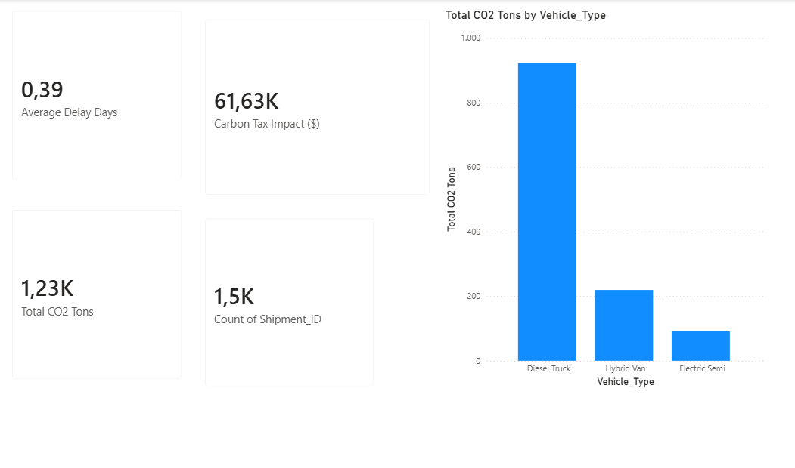
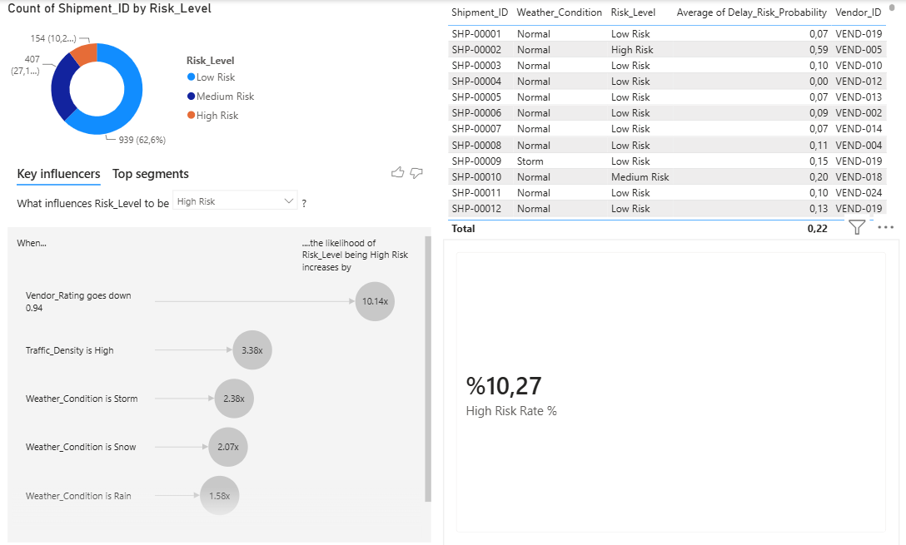

# 🚚 Logistics Delay-Risk Prediction & Carbon Cost Dashboard

**Calibrated delay-risk scoring for shipments, wired into a Power BI star schema and a live Streamlit demo — with the carbon cost of each shipment priced alongside it.**

[](https://arda-lojistik-panel.streamlit.app)
[](https://github.com/ardayal1907/logistics-early-warning-dashboard)
[](LICENSE)

[](https://github.com/ardayal1907/logistics-early-warning-dashboard/actions/workflows/tests.yml)

### ▶️ **[Try the live risk scorer →](https://arda-lojistik-panel.streamlit.app)**

Enter a shipment's vendor rating, route and load conditions; get a calibrated delay
probability, a cost-derived risk tier, and the calculated carbon cost.

### 📊 The Power BI Report

**Page 1 — Executive Summary:** fleet-level KPIs and the emissions gap between vehicle types.



**Page 2 — Early Warning Panel:** the High Risk Rate KPI, risk distribution, AI-driven Key Influencers, and the shipment-level risk table.



---

## What this is

Late shipments and untracked emissions both carry hidden costs — customer churn,
penalty clauses, and regulatory exposure. This project scores every shipment with a
**calibrated delay probability** and a `Risk_Level` tier whose cut-offs are derived
from a cost matrix rather than picked by hand, then surfaces both alongside a carbon
cost estimate in a 2-page Power BI report. A Streamlit app scores a single
hypothetical shipment against the same production model. The pipeline runs
end-to-end: synthetic data generation → star-schema ETL → training and scoring →
BI layer.

> ⚠️ **Scope note:** this is a portfolio project built on **synthetic data**. It shows
> how such a pipeline is *constructed and validated*; it is not evidence of real-world
> predictive performance. Anything the model "discovers" about why shipments are late
> is a readback of assumptions written into the generator. Read
> [Known Limitations](#known-limitations) before quoting any figure from it.

---

## 🏗️ Architecture

The project follows a classic **Medallion-style ETL → ML → BI** flow, ending in a Star Schema optimized for Power BI's VertiPaq engine.

```
┌─────────────────────┐     ┌──────────────────────┐     ┌───────────────────────┐     ┌────────────────────────┐
│   1. Data Generation │     │   2. ETL / Star       │     │   3. ML Scoring        │     │   4. Power BI Model     │
│   (Python)           │ ──▶ │   Schema Modeling     │ ──▶ │   (scikit-learn)       │ ──▶ │   & Visualization       │
│                       │     │   (Python / pandas)   │     │                        │     │                         │
│ smart_logistics_      │     │ Dim_Vendor.csv        │     │ Random Forest          │     │ Star Schema relations   │
│ data.csv (1,500 rows) │     │ Dim_Route.csv         │     │ Classifier             │     │ DAX measures            │
│                       │     │ Fact_Shipments.csv    │     │ → Delay_Risk_          │     │ 2-page report           │
│                       │     │                       │     │   Probability          │     │ (Executive Summary +    │
│                       │     │                       │     │ → Risk_Level           │     │  Early Warning Panel)   │
└─────────────────────┘     └──────────────────────┘     └───────────────────────┘     └────────────────────────┘
```

```
logistics-early-warning-dashboard/
├── README.md
├── LICENSE
├── requirements.txt
├── .gitignore
├── src/
│   ├── config.py                      shared constants (carbon model)
│   ├── generate_logistics_data.py     1. synthetic data generation
│   ├── etl_star_schema.py             2. star schema ETL
│   ├── ml_delay_risk_pipeline.py      3. training, scoring, model export
│   └── app.py                         Streamlit demo
├── notebooks/
│   └── Logistics_Delay_Risk_ML_Pipeline.ipynb    teaching walkthrough
├── data/
│   ├── raw/         smart_logistics_data.csv
│   └── processed/   Dim_Vendor · Dim_Route · Dim_Date · Fact_Shipments
│                    · Fact_Shipments_with_ML   ← consumed by Power BI
├── models/
│   ├── production_risk_model.pkl              full pipeline, joblib
│   └── production_risk_model_metadata.json    thresholds, metrics, versions
├── powerbi/
│   ├── Lojistik_Erken_Uyari_Paneli.pbix
│   └── measures.dax                   DAX measures as reviewable plain text
├── tests/                             pytest suite (114 tests)
├── docs/
│   └── METHODOLOGY.md                 full technical reference
└── screenshots/
```

All scripts resolve their paths relative to the repository root, so they can be run
from any working directory.

> ### ⚠️ The carbon constants live in two systems
>
> `src/config.py` is the single source of truth for the CO₂ model — emission factors,
> the fixed base emission, the weather/traffic multipliers, and
> `CARBON_PRICE_PER_TON = 50`. Both `generate_logistics_data.py` and `app.py` import
> from it; neither re-declares a constant.
>
> **Power BI cannot import from Python.** The `Carbon Tax Impact ($)` DAX measure
> hardcodes the same figure:
>
> ```dax
> Carbon Tax Impact ($) = [Total CO2 Tons] * 50
> ```
>
> So the carbon price is synchronised across **two** places, and one of them is
> manual: change `CARBON_PRICE_PER_TON` in `src/config.py` and you **must** edit that
> DAX measure inside the `.pbix` by hand. Nothing will warn you if you forget — the
> Streamlit demo and the dashboard will simply disagree.
>
> All four DAX measures are mirrored as plain text in
> [`powerbi/measures.dax`](powerbi/measures.dax) so the semantic model can be read and
> diffed without opening Power BI. The mirror is verified, not transcribed from memory:
> the expressions were read out of the live model with DAX Studio
> (`$SYSTEM.TMSCHEMA_MEASURES`, which returned exactly four rows — the model holds no
> other measure), and the visual bindings by parsing the `.pbix` report-definition JSON.

📖 **[Full technical reference → `docs/METHODOLOGY.md`](docs/METHODOLOGY.md)** — data
model, DAX measures, every modelling decision with the measurements behind it, the
methodology checklist, and the complete limitations list.

---

## 🎯 Three Critical Technical Decisions

These three are what separate this from a notebook that reports an accuracy score.

### 1. The probabilities are calibrated — and it was measured

A Random Forest's `predict_proba` is the fraction of trees voting positive, **not a
probability**. Uncalibrated, this model said 0.65 where the realised delay rate was
0.36 (ECE **0.137**). Wrapping it in `CalibratedClassifierCV` cut calibration error to
**0.023** — so "30%" now genuinely means *about 30%*. Isotonic vs sigmoid was decided
by measurement, not rule of thumb: isotonic won on **5 of 5** random seeds.

### 2. Risk thresholds come from a cost matrix, not percentiles

Earlier versions used the score distribution's p95/p80 — but "the riskiest 5%" has no
business justification. A missed delay (SLA penalty, expedited re-routing, churn risk)
is assumed **4× costlier** than a false alarm (a planner's phone call). With calibrated
probabilities the optimal cut-off is analytic: `p* = 1/(1+4) = 0.20`. The percentile
threshold turned out to catch only **18%** of delays at **45% higher** expected cost.

### 3. Validation is chronological, and the score went down

| Split strategy | ROC-AUC | What it allows |
|---|---|---|
| `StratifiedKFold` (random) | 0.781 | Uses the future to predict the past |
| `StratifiedGroupKFold` on `Vendor_ID` | 0.758 | Still uses the future |
| **Chronological holdout** | **0.737** | Nothing unavailable in production |

Each restriction costs a few points, and **that cost is the measurement being
corrected, not performance being lost.** The drop is explained by measured seasonal
distribution shift: the test window is summer, where `Snow` is 0% (vs 16% in training)
and the strongest weather signal effectively disappears.

📖 Also in [`docs/METHODOLOGY.md`](docs/METHODOLOGY.md): why impurity importance ranks a
pure-noise column above a real driver, the Bayes-ceiling calculation, the
weather × vendor interaction, and the vendor-memorisation hypothesis that was tested
and **disproved**.

---

<a id="known-limitations"></a>

## ⚠️ Known Limitations

1. **Synthetic data.** No figure here predicts real-world performance. On real data the
   hardest problem would likely not be modelling at all, but the fact that
   `Actual_Delay_Days` is rarely recorded consistently across carriers.
2. **Only one seasonal cycle.** Seasonality can be modelled but year-over-year change
   cannot. Vendor quality is constant over time in this data — the concept drift that
   forces periodic retraining in reality is untested here.
3. **No planner-capacity constraint in the cost model.** The thresholds flag ~37% of
   shipments for some action. If the team cannot work that volume, the optimisation is
   solving the wrong problem.
4. **Calibration is weakest in the tail.** Overall ECE is 0.023, but the top bucket
   (p > 0.8) holds few observations. Treat "85% likely to be late" with more caution
   than "30% likely".

📖 [Full list of 8 limitations, with the methodology checklist →](docs/METHODOLOGY.md#known-limitations)

---

## ⚙️ How to Run

The repository ships with the generated data and a trained model, so you can open the
Power BI report or launch the Streamlit demo without running anything. The steps below
regenerate everything from scratch.

```bash
pip install -r requirements.txt
```

```bash
python src/generate_logistics_data.py   # → data/raw/smart_logistics_data.csv
python src/etl_star_schema.py           # → data/processed/ dimension + fact tables
python src/ml_delay_risk_pipeline.py    # → scored fact table + models/*.pkl
streamlit run src/app.py                # → local demo at localhost:8501
```

For the Power BI report, open `powerbi/Lojistik_Erken_Uyari_Paneli.pbix`, point the
data sources at `data/processed/`, and refresh. The `Dim_Date` relationship must be
created once by hand —
[setup steps →](docs/METHODOLOGY.md#powerbi-setup).

> **Deployment note:** `requirements.txt` pins exact versions. The model is a pickle
> and scikit-learn's object layout changes between releases — a version mismatch either
> fails to load the model or silently produces different predictions.

### Tests

```bash
pip install -r requirements.txt -r requirements-dev.txt
pytest tests/ -q
```

114 tests covering the things that break silently rather than loudly: that the CO₂
figures in the data still follow the constants in `config.py`, that the risk tiers are
exact at their boundaries, that each ETL stage transforms correctly on a hand-built
frame, that the generator is deterministic and seasonal, that the saved model loads and
scores a raw DataFrame, that `Fact_Shipments_with_ML.csv` keeps the 10 columns Power BI
is bound to, that every foreign key resolves, that the committed model and the
committed data have not drifted apart, and that no script re-declares a shared constant
instead of importing it.

**Stale-model guard.** The pipeline records a SHA-256 fingerprint of the data it
trained on (`training_data_sha256` and `source_tables_sha256` in the model metadata).
The Streamlit app recomputes it at startup and warns if the files on disk have changed
since — otherwise a regenerated dataset would be scored by a stale model with nothing
to indicate it. The same check runs in CI, so drift fails the build rather than
surfacing in the app.

Every pipeline script is structured as functions behind `main()`, so importing one has
no side effects and each stage can be unit-tested directly rather than by running the
whole pipeline.

The suite is mutation-checked: 13 deliberate faults — a changed emission factor, a
threshold comparison flipped from `>=` to `>`, a cost ratio changed without updating
the derived threshold, `Dim_Vendor` aggregating with `max` instead of `mean`, a
non-contiguous date calendar, a disabled foreign-key assertion, a changed target delay
rate, a disabled chronological-leakage guard, an unweighted alert cost, seasonality
removed, a disabled data/model sync comparison, broken file hashing, and a fingerprint
no longer recorded — **all 13 produced failures.**

---

## 📄 License

[MIT](LICENSE) — Copyright © 2026 Arda Yalçın. Built on fully synthetic data generated
for demonstration and portfolio purposes.
